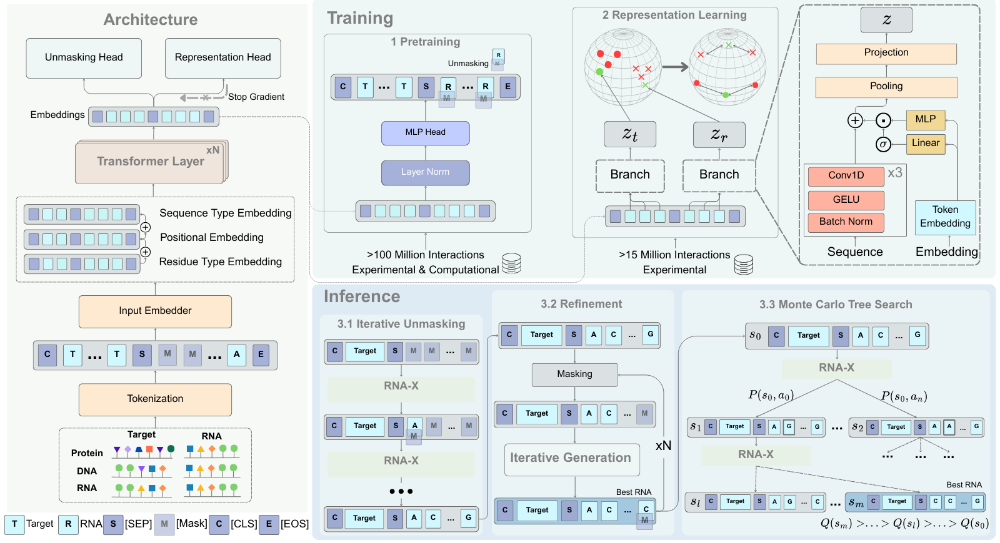

<h1 align="left" style="color:#00aa55">RNA-X</h1>
<h3 align="left">Modeling RNA interactions to design binder RNA and simultaneously target multiple molecules of different types</h3>

---

## Authors

Sobhan Shukueian Tabrizi, Helyasadat Hashemi Aghdam, A. Ercument Cicek

---

# Overview

**RNA-X** is the first RNA interaction foundation model. RNA-X can design an RNA sequence to target RNA, DNA, and proteins; and can design a single RNA molecule to simultaneously bind to multiple targets for the first time. RNA-X, is a masked language model trained end-to-end on more than hundred million RNA-target interactions. It learns joint representations of RNA and target molecules, enabling direct sampling of RNA sequences with desired binding properties.


<div align="center">
  
</div>

---

# Table of Contents

- [Installation](#installation)
- [File & Folder Structure](#file--folder-structure)
  - [Training](#training)
  - [Generation](#generation)
  - [Representation](#representation)
- [Citations](#citations)
- [License](#license)
- [Contact](#contact)

---

# Installation

RNA-X is implemented in Python and uses PyTorch along with Hugging Face Accelerate for distributed training. We recommend using Conda to manage dependencies.

## Requirements

Create a dedicated Conda environment using the provided YAML file:

```bash
conda env create --name rnax -f environment.yml
conda activate rnax
```

## File & Folder Structure

```
rna-x/
├── train.py                # Training procedure.
├── generation.py             # RNA generation.
├── embeddings.py             # RNA + Target representation.
├── environment.yml         # Conda environment file.
├── src/                    # Source code for models, data handling, and utilities.
│   ├── models/
│   ├── data/
|   ├── generation/  
|   ├── representation/  
│   ├── layers/
│   └── utils/
└── examples/               # Example inputs and outputs.
    ├── protein.fasta        # Example protein FASTA file.
```
---


# Usage

RNA-X supports three main operational modes: training, generation, and representation learning.

## Training

To train the model, use your preferred accelerator setup to launch the training procedure.
```bash
CUDA_VISIBLE_DEVICES=0,1 accelerate launch --config_file accelerate_config train.py 
```

## Generation

RNA-X generates RNA sequences conditioned on a target. You can provide the input as a FASTA file. 

```bash
python generation.py \
    --targets-fasta examples/protein.fasta \
    --output-dir outputs \
    --n-per-target 1 \
    --rna-length 10 \
    --score-threshold 0.6 \
    --target-type protein \
    --model-path weights/checkpoint \
    --prediction-model-dir weights/prediction
```

### Command-line arguments
```--targets-fasta PATH```
Path to the FASTA file containing your targets (protein/DNA/RNA).

```--output-dir PATH (default: outputs)```
Directory where results are written. The script will create it if needed and write: generated_rnas.fasta, generated_rnas.json

```--n-per-target INT (default: 20)```
Number of accepted RNA sequences to generate per target. The script keeps sampling until this many sequences pass the score threshold for each target.

```--rna-length INT (default: 50)```
Length of each generated RNA sequence.

```--score-threshold FLOAT [0, 1] (default: 0.6)```
Minimum predicted score required for a generated RNA to be accepted. Higher thresholds usually mean more attempts and better-scoring sequences.

```--target-type {protein,dna,rna} (default: protein)```
Type of sequences in --targets-fasta, which also selects the prediction model: protein → uses prediction/protein.pth

```--model-path PATH (default: weights/checkpoint)```
Path to the main RNA-X model checkpoint.

```--prediction-model-dir PATH (default: weights/prediction)```
Directory where prediction model files <target_type>.pth are stored.

```--no-mcts```
Disable MCTS during generation (apply_mcts=False). Use if you want a simpler generation strategy or for debugging.

```--no-scoring```
Disable the scoring model (use_scoring=False). In this mode, the script will not filter by a learned scoring model and the --score-threshold is effectively ignored. Useful for quick, unconstrained sampling.


The generated sequences are stored in the designated inference directory. Adjust generation parameters such as the number of candidates, maximum sequence length, sampling strategy, and beam settings as needed.

## Representation

This repository also provides a **representation (embedding) module** that encodes target–RNA pairs into fixed-dimensional. There are two modes:
1. **Base RNA-X only (`rt_type=base`)**  
   Uses the base RT encoder to obtain target and RNA embeddings.

2. **RNA-X + head (`rt_type=head`)**  
   Uses the base RNA-X encoder plus an additional representation headtrained specifically for a given modality (e.g. DNA).
   
```
python embeddings.py \
  --targets-file data/example_targets.txt \
  --rnas-file data/example_rnas.txt \
  --base-model-path weights/base_rt_model \
  --rt-model-path weights/representation/dna.pt \
  --rt-type head \
  --output-path outputs/dna_rt_embeddings.pt
```

### Command-line arguments
```--targets-file PATH``` Text file with one target sequence per line.Sequences can be plain (ATCG..., MKT...) or already prefixed (DNA:..., AA:..., RNA:...).

```--rnas-file PATH (required)``` Text file with one RNA sequence per line (paired with targets-file).

```--output-path PATH (default: outputs/rt_embeddings.pt)```

```--base-model-path PATH``` Directory containing the base RT model, used by create_embedder.

```--rt-model-path PATH (required if --rt-type head))``` Path to the RT head checkpoint, default: weights/representation/dna.pt

```--rt-type {head,base}``` (default: head)

You can also use the embedder directly from Python:

``` 
from src.representation.embedder import setup_embedder

seq_embedder = setup_embedder(
    embedder_type="rt",
    base_model_path="weights/checkpoint",
    rt_model_path="weights/representation/dna.pt",
    rt_type="head",
)

targets = ["DNA:ATCGATCG", "DNA:ATCGATCGCCG"]
rnas = ["RNA:AUGCUAGC", "RNA:GGCUAUGC"]

t_emb, r_emb = seq_embedder.embed_sequences(targets, rnas)
t_emb.size(), r_emb.size()
```
---

## Citations

If you use RNA-X in your research, please consider citing our work

---

## License

- **[CC BY-NC-SA 2.0](https://creativecommons.org/licenses/by-nc-sa/2.0/)**
- © [Year] RNA-X. For academic use only. For commercial applications, please contact the corresponding authors.

---

## Contact

For questions or comments regarding RNA-X, please contact:

- **Sobhan Shukueian Tabrizi:** [shukueian@gmail.com](mailto:shukueian@gmail.com)  

